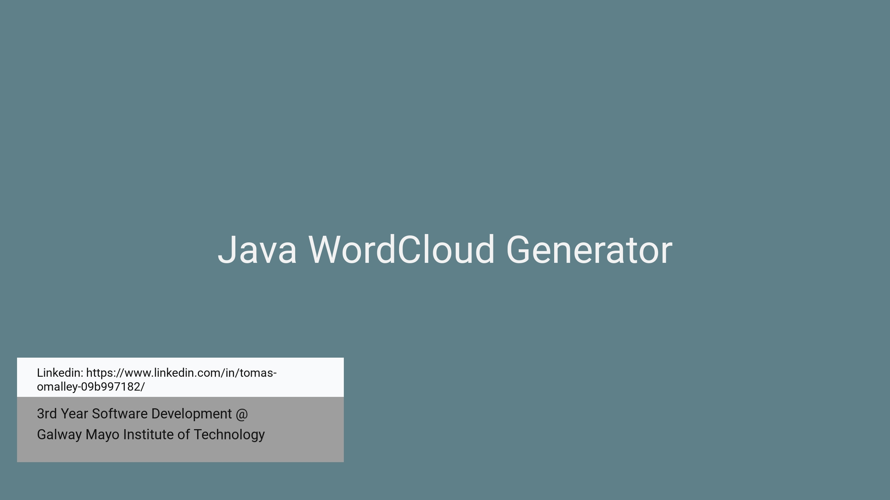
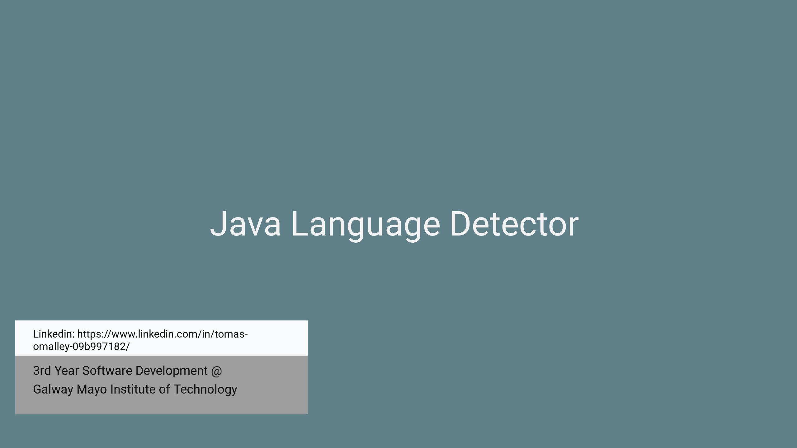

## Portfolio

Software Development  
---

### College Projects

[  Python  NFA Builder  ](https://github.com/OmalleyTomas98/graphTheoryProject)

---
[ Java WordCloud Generator ](https://github.com/OmalleyTomas98/JavaWordCloudGenerator)

---
[Java  Language Detector ](https://github.com/OmalleyTomas98/MultithreadedLanguageDetector)

---

### Myself
[  Course Background  ](/sample_page)

### Other College Projects

- [Advanced C Project](https://github.com/OmalleyTomas98/ABC-DENTAL-C-APP)
- [MERN React Web App](https://github.com/OmalleyTomas98/RecordShopReactApp)
- [Operating Systems Java TCP Project](https://github.com/OmalleyTomas98/FootballClubApplication)
- [Advanced Data Centric Java Spring App](https://github.com/OmalleyTomas98/AdvancedDataCentric)
- [Unity  C#  2D Game](https://github.com/OmalleyTomas98/unityProcaffeinatingFPSgame)

---

---
